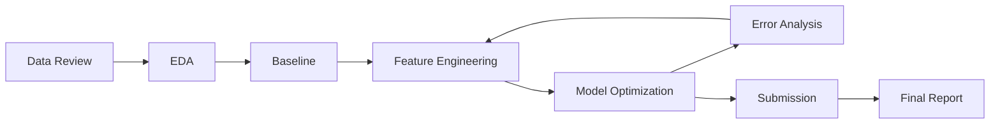
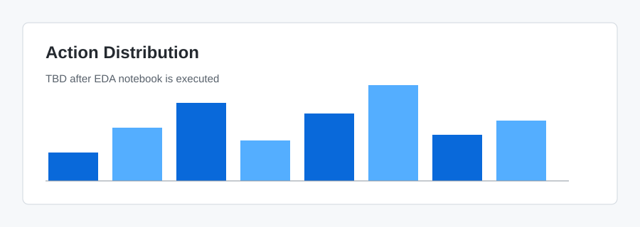

# AI-Agent-Dacon-2026

[](https://dacon.io/competitions/official/236694/overview/description)


Portfolio-oriented repository for the DACON AI Agent action prediction competition.

This project predicts the next action an AI coding agent should take while interacting with a user. The target is one of 14 action classes, such as reading a file, searching code, editing, running tests, asking the user, planning, web searching, or responding directly.

> Current stage: repository structure and documentation templates are prepared. Modeling work is planned.

## Table of Contents

- [Project Overview](#project-overview)
- [Problem Definition](#problem-definition)
- [What We Build](#what-we-build)
- [Workflow](#workflow)
- [Tech Stack](#tech-stack)
- [Repository Structure](#repository-structure)
- [Roadmap](#roadmap)
- [Experiment Log](#experiment-log)
- [Team](#team)
- [Portfolio Value](#portfolio-value)

## Project Overview

| Item | Description |
| --- | --- |
| Competition | DACON AI Agent action prediction |
| Task | Multi-class classification |
| Target | 14 assistant action classes |
| Train data | 70,000 samples |
| Evaluation data | 30,000 private samples |
| Main input | Session metadata, history, current prompt |
| Output | `id,action` submission CSV |
| Status | Planned |

The competition represents an important behavior inside AI coding agents: deciding the next useful action from conversation and workspace context.

## Problem Definition

Given a session snapshot, predict the assistant's next action.

### Input

- `session_meta`: user tier, language preference, token budget, turn index, elapsed time, workspace state
- `history`: previous user messages and assistant actions
- `current_prompt`: latest user request

### Output

One of the 14 action classes:

| Group | Classes |
| --- | --- |
| File and workspace inspection | `read_file`, `grep_search`, `list_directory`, `glob_pattern` |
| File modification | `edit_file`, `write_file`, `apply_patch` |
| Execution and verification | `run_bash`, `run_tests`, `lint_or_typecheck` |
| Reasoning and communication | `ask_user`, `plan_task`, `web_search`, `respond_only` |

## What We Build

This repository is designed to support the full competition lifecycle:

- Reproducible data loading and preprocessing
- Exploratory data analysis notebooks
- Baseline and improved modeling pipelines
- Experiment tracking templates
- Error analysis and model comparison documents
- Final competition report for portfolio review

No leaderboard score is claimed yet. Scores will be added only after measured experiments.

## Workflow



## Tech Stack

| Area | Tools |
| --- | --- |
| Language | Python |
| Data handling | pandas, numpy |
| Modeling | scikit-learn, LightGBM, XGBoost, CatBoost, Transformers |
| Experimentation | Jupyter, Markdown experiment logs |
| Visualization | matplotlib, seaborn |
| Quality | ruff, pytest |
| Collaboration | Git, GitHub, GitHub Pages-ready Markdown |

## Repository Structure

```text
AI-Agent-Dacon-2026/
|-- README.md
|-- requirements.txt
|-- data/
|   `-- .gitkeep
|-- docs/
|   |-- 01_Project_Overview.md
|   |-- 02_AI_Agent.md
|   |-- 03_Competition_Analysis.md
|   |-- 04_Data_Analysis.md
|   |-- 05_Baseline.md
|   |-- 06_Error_Analysis.md
|   |-- 07_Feature_Engineering.md
|   |-- 08_Model_Optimization.md
|   |-- 09_Experiment_Log.md
|   `-- 10_Final_Report.md
|-- notebooks/
|   |-- EDA.ipynb
|   |-- Error_Analysis.ipynb
|   `-- Feature_Engineering.ipynb
|-- experiments/
|   |-- exp01_baseline.md
|   |-- exp02_feature_engineering.md
|   `-- exp03_model_change.md
|-- src/
|   |-- data/
|   |-- evaluation/
|   |-- features/
|   |-- inference/
|   |-- models/
|   |-- training/
|   `-- utils/
|-- results/
|   |-- figures/
|   `-- submissions/
|-- models/
`-- logs/
```

## Documentation

| Document | Purpose |
| --- | --- |
| [Project Overview](docs/01_Project_Overview.md) | Project scope and goals |
| [AI Agent](docs/02_AI_Agent.md) | Agent action classes and decision context |
| [Competition Analysis](docs/03_Competition_Analysis.md) | Rules, data, submission assumptions |
| [Data Analysis](docs/04_Data_Analysis.md) | Dataset schema and EDA plan |
| [Baseline](docs/05_Baseline.md) | Baseline design and reproduction plan |
| [Error Analysis](docs/06_Error_Analysis.md) | Error review framework |
| [Feature Engineering](docs/07_Feature_Engineering.md) | Feature candidates and tracking |
| [Model Optimization](docs/08_Model_Optimization.md) | Model comparison and tuning plan |
| [Experiment Log](docs/09_Experiment_Log.md) | Experiment index |
| [Final Report](docs/10_Final_Report.md) | Final summary template |

## Notebooks

| Notebook | Status | Description |
| --- | --- | --- |
| [EDA.ipynb](notebooks/EDA.ipynb) | Planned | Dataset exploration and distribution analysis |
| [Error_Analysis.ipynb](notebooks/Error_Analysis.ipynb) | Planned | Confusion matrix and failure review |
| [Feature_Engineering.ipynb](notebooks/Feature_Engineering.ipynb) | Planned | Feature design and validation |

## Results

Figures and submission files will be stored under `results/`.

Planned image slots:




## Roadmap

Progress: `15%`

| Phase | Status | Deliverable |
| --- | --- | --- |
| Repository setup | Done | Folder and documentation structure |
| Competition rule review | Planned | Confirmed rule checklist |
| EDA | Planned | Dataset statistics and figures |
| Baseline | Planned | Reproducible first model |
| Feature engineering | Planned | Feature set comparison |
| Model optimization | Planned | Tuned model candidates |
| Error analysis | Planned | Failure taxonomy |
| Final submission | Planned | Submission package |
| Final report | Planned | Portfolio-ready report |

Checklist:

- [x] Create repository structure
- [x] Add documentation templates
- [x] Add experiment templates
- [x] Add starter notebooks
- [ ] Review official rules and metric
- [ ] Implement baseline pipeline
- [ ] Run first validation experiment
- [ ] Submit first valid prediction file
- [ ] Complete final report

## Experiment Log

| ID | Title | Status | Validation Score | Public Score | Link |
| --- | --- | --- | ---: | ---: | --- |
| exp01 | Baseline | Planned | TBD | TBD | [exp01_baseline](experiments/exp01_baseline.md) |
| exp02 | Feature Engineering | Planned | TBD | TBD | [exp02_feature_engineering](experiments/exp02_feature_engineering.md) |
| exp03 | Model Change | Planned | TBD | TBD | [exp03_model_change](experiments/exp03_model_change.md) |

## Team

| Role | Member | Responsibility |
| --- | --- | --- |
| Team member | TBD | Data analysis |
| Team member | TBD | Modeling |
| Team member | TBD | Experiment tracking |
| Team member | TBD | Documentation |

## Portfolio Value

This repository is structured to show more than a final score:

- Problem framing for AI agent behavior prediction
- Reproducible machine learning workflow
- Clear experiment history
- Technical writing through `docs/`
- Evidence-based model improvement through analysis
- GitHub Pages-friendly project documentation

## References

- [DACON Competition Description](https://dacon.io/competitions/official/236694/overview/description)
- [DACON Competition Rules](https://dacon.io/competitions/official/236694/overview/rules)
