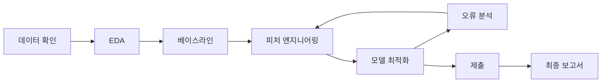

# AI-Agent-Dacon-2026

[](https://dacon.io/competitions/official/236694/overview/description)


DACON AI Agent 행동 예측 대회를 시작하기 위한 팀 프로젝트 저장소입니다.

이 프로젝트는 AI 코딩 에이전트가 사용자와 대화하며 작업하는 중, 다음에 어떤 행동을 해야 하는지 14개 클래스 중 하나로 예측하는 문제를 다룹니다.

현재 이 저장소는 **대회 시작 전 초기 세팅 단계**입니다. 아직 EDA, 모델 학습, 검증 실험, 리더보드 제출은 진행하지 않았습니다. 대신 팀이 바로 작업을 시작할 수 있도록 폴더 구조, 문서 템플릿, 실험 기록 양식, 코드 작성 위치를 먼저 만들어두었습니다.

> 현재 단계: 프로젝트 초기 구조 설계 완료. 실험과 모델링은 아직 진행 전입니다.

## 목차

- [프로젝트 개요](#프로젝트-개요)
- [문제 정의](#문제-정의)
- [무엇을 만들 것인가](#무엇을-만들-것인가)
- [진행 흐름](#진행-흐름)
- [기술 스택](#기술-스택)
- [저장소 구조](#저장소-구조)
- [폴더 설명](#폴더-설명)
- [시작 방법](#시작-방법)
- [로드맵](#로드맵)
- [실험 로그](#실험-로그)
- [팀](#팀)
- [포트폴리오 가치](#포트폴리오-가치)

## 프로젝트 개요

| 항목 | 내용 |
| --- | --- |
| 대회 | DACON AI Agent 행동 예측 |
| 문제 유형 | 다중 클래스 분류 |
| 예측 대상 | 14개 에이전트 action 클래스 |
| 학습 데이터 | 70,000개 샘플 |
| 평가 데이터 | 비공개 30,000개 샘플 |
| 주요 입력 | 세션 메타데이터, 이전 대화/행동 기록, 현재 사용자 발화 |
| 제출 형식 | `id,action` CSV |
| 현재 상태 | 초기 템플릿 구축 완료 / 실험 전 |

이 대회는 AI 코딩 에이전트가 파일을 읽을지, 검색할지, 코드를 수정할지, 테스트를 실행할지, 사용자에게 질문할지 같은 의사결정을 데이터 기반으로 예측하는 문제입니다.

현재 저장소의 역할은 다음과 같습니다.

- 대회 데이터를 정리할 위치를 정합니다.
- EDA와 오류 분석을 어떤 순서로 진행할지 정리합니다.
- 베이스라인 코드가 들어갈 기본 모듈 위치를 만듭니다.
- 실험 결과를 매번 같은 형식으로 기록할 수 있게 합니다.
- 대회가 끝난 뒤에도 포트폴리오로 설명 가능한 문서 구조를 유지합니다.

## 문제 정의

주어진 에이전트 세션의 특정 시점 상태를 보고, 에이전트가 다음에 수행할 행동을 예측합니다.

### 입력

- `session_meta`: 사용자 등급, 선호 언어, 남은 토큰 예산, 현재 턴, 세션 경과 시간, 작업공간 상태
- `history`: 이전 사용자 발화와 에이전트 행동 기록
- `current_prompt`: 현재 사용자 발화

### 출력

아래 14개 클래스 중 하나를 예측합니다.

| 그룹 | 클래스 |
| --- | --- |
| 파일/작업공간 탐색 | `read_file`, `grep_search`, `list_directory`, `glob_pattern` |
| 파일 수정 | `edit_file`, `write_file`, `apply_patch` |
| 실행/검증 | `run_bash`, `run_tests`, `lint_or_typecheck` |
| 추론/응답 | `ask_user`, `plan_task`, `web_search`, `respond_only` |

## 무엇을 만들 것인가

이 저장소에서는 앞으로 다음 산출물을 구축합니다.

- 재현 가능한 데이터 로딩 및 전처리 파이프라인
- EDA, 오류 분석, 피처 엔지니어링 노트북
- 베이스라인 및 개선 모델 학습 코드
- 실험 기록 템플릿과 점수 추적표
- 대회 분석, 데이터 분석, 모델 최적화 문서
- 최종 포트폴리오용 보고서

아직 리더보드 점수나 검증 점수는 기록하지 않았습니다. 실제 실험 이후 측정된 값만 추가합니다.

## 진행 흐름



## 기술 스택

| 영역 | 도구 |
| --- | --- |
| 언어 | Python |
| 데이터 처리 | pandas, numpy |
| 모델링 | scikit-learn, LightGBM, XGBoost, CatBoost, Transformers |
| 실험 | Jupyter, Markdown experiment logs |
| 시각화 | matplotlib, seaborn |
| 품질 관리 | ruff, pytest |
| 협업 | Git, GitHub, GitHub Pages-ready Markdown |

## 저장소 구조

```text
AI-Agent-Dacon-2026/
|-- README.md
|-- requirements.txt
|-- configs/
|   `-- default.yaml
|-- data/
|   |-- README.md
|   `-- .gitkeep
|-- docs/
|   |-- 01_Project_Overview.md
|   |-- 02_AI_Agent.md
|   |-- 03_Competition_Analysis.md
|   |-- 04_Data_Analysis.md
|   |-- 05_Baseline.md
|   |-- 06_Error_Analysis.md
|   |-- 07_Feature_Engineering.md
|   |-- 08_Model_Optimization.md
|   |-- 09_Experiment_Log.md
|   `-- 10_Final_Report.md
|-- notebooks/
|   |-- README.md
|   |-- EDA.ipynb
|   |-- Error_Analysis.ipynb
|   `-- Feature_Engineering.ipynb
|-- experiments/
|   |-- exp01_baseline.md
|   |-- exp02_feature_engineering.md
|   `-- exp03_model_change.md
|-- src/
|   |-- README.md
|   |-- __init__.py
|   |-- data/
|   |   `-- load_data.py
|   |-- evaluation/
|   |   `-- metrics.py
|   |-- features/
|   |   `-- build_features.py
|   |-- inference/
|   |   `-- predict.py
|   |-- models/
|   |-- training/
|   |   `-- train_baseline.py
|   `-- utils/
|       `-- config.py
|-- results/
|   |-- README.md
|   |-- figures/
|   `-- submissions/
|-- models/
|   `-- README.md
`-- logs/
    `-- README.md
```

## 폴더 설명

각 폴더는 아래 목적을 가집니다. 아직 실제 실험 산출물은 없으며, 앞으로 작업하면서 채워 넣는 구조입니다.

| 경로 | 설명 | 현재 상태 |
| --- | --- | --- |
| `configs/` | 학습/추론 설정값을 관리합니다. seed, split, feature, model parameter 등을 한 곳에서 관리하기 위한 위치입니다. | 기본 설정 템플릿만 있음 |
| `data/` | DACON에서 받은 원본 데이터와 전처리 데이터를 둘 위치입니다. 대용량 원본 데이터는 Git에 올리지 않고 로컬에서 관리합니다. | 설명 파일만 있음 |
| `docs/` | 프로젝트 이해, 대회 분석, 데이터 분석, 모델링 전략, 최종 보고서를 작성하는 기술 문서 공간입니다. | 문서 템플릿 있음 |
| `notebooks/` | EDA, 오류 분석, 피처 실험을 빠르게 확인하는 Jupyter 노트북 공간입니다. | 빈 분석 노트북 템플릿 있음 |
| `experiments/` | 실험 목적, 변경 사항, 검증 점수, 제출 점수, 배운 점을 기록하는 공간입니다. | 실험 기록 양식 있음 |
| `src/` | 실제 재사용 가능한 Python 코드가 들어가는 공간입니다. 노트북에서 검증한 로직을 이곳으로 옮깁니다. | 코드 뼈대만 있음 |
| `results/` | 그래프, confusion matrix, 제출 파일 등을 저장합니다. | placeholder 이미지만 있음 |
| `models/` | 학습된 모델 파일을 로컬에 저장하는 위치입니다. 큰 모델 파일은 Git에 올리지 않습니다. | 설명 파일만 있음 |
| `logs/` | 학습 로그, 실험 로그, 실행 로그를 저장합니다. | 설명 파일만 있음 |

## 시작 방법

아래 순서는 앞으로 팀이 실제 작업을 시작할 때의 권장 흐름입니다.

1. DACON에서 받은 데이터를 `data/raw/`에 둡니다.
2. [데이터 분석 문서](docs/04_Data_Analysis.md)와 [EDA 노트북](notebooks/EDA.ipynb)을 채우며 데이터 구조를 확인합니다.
3. [베이스라인 문서](docs/05_Baseline.md)를 기준으로 첫 baseline 코드를 구현합니다.
4. 첫 실험 결과를 [exp01_baseline](experiments/exp01_baseline.md)에 기록합니다.
5. 오류 분석 결과를 [오류 분석 문서](docs/06_Error_Analysis.md)에 정리합니다.
6. 피처 엔지니어링과 모델 변경 실험을 반복하며 `experiments/`에 누적합니다.

현재 명령어는 실행 가능한 최종 파이프라인이 아니라, 앞으로 구현할 기준 명령의 형태입니다.

```bash
pip install -r requirements.txt
python -m src.training.train_baseline --config configs/default.yaml
python -m src.inference.predict --config configs/default.yaml
```

## 문서 안내

| 문서 | 목적 |
| --- | --- |
| [프로젝트 개요](docs/01_Project_Overview.md) | 프로젝트 목표와 범위 정리 |
| [AI Agent 이해](docs/02_AI_Agent.md) | 에이전트 action 클래스와 의사결정 맥락 |
| [대회 분석](docs/03_Competition_Analysis.md) | 규칙, 데이터, 제출 형식 정리 |
| [데이터 분석](docs/04_Data_Analysis.md) | 데이터 구조와 EDA 계획 |
| [베이스라인](docs/05_Baseline.md) | 베이스라인 설계와 재현 계획 |
| [오류 분석](docs/06_Error_Analysis.md) | 모델 실패 사례 분석 프레임 |
| [피처 엔지니어링](docs/07_Feature_Engineering.md) | 후보 피처와 실험 추적 |
| [모델 최적화](docs/08_Model_Optimization.md) | 모델 비교와 튜닝 계획 |
| [실험 로그](docs/09_Experiment_Log.md) | 실험 기록 인덱스 |
| [최종 보고서](docs/10_Final_Report.md) | 대회 종료 후 보고서 템플릿 |

## 노트북

| 노트북 | 상태 | 설명 |
| --- | --- | --- |
| [EDA.ipynb](notebooks/EDA.ipynb) | 예정 | 데이터 분포와 기본 통계 분석 |
| [Error_Analysis.ipynb](notebooks/Error_Analysis.ipynb) | 예정 | 혼동 행렬과 오답 패턴 분석 |
| [Feature_Engineering.ipynb](notebooks/Feature_Engineering.ipynb) | 예정 | 피처 설계와 검증 |

## 결과물

그래프, 분석 이미지, 제출 파일은 `results/` 아래에 저장합니다.

예정 이미지:


## 로드맵

진행률: `10%`

| 단계 | 상태 | 산출물 |
| --- | --- | --- |
| 저장소 구조 설계 | 완료 | 폴더 구조와 문서 템플릿 |
| 대회 규칙 확인 | 예정 | 규칙 체크리스트 |
| EDA | 예정 | 데이터 통계와 시각화 |
| 베이스라인 | 예정 | 재현 가능한 첫 모델 |
| 피처 엔지니어링 | 예정 | 피처 조합별 성능 비교 |
| 모델 최적화 | 예정 | 튜닝된 모델 후보 |
| 오류 분석 | 예정 | 오답 유형 정리 |
| 최종 제출 | 예정 | 제출 파일 및 코드 패키지 |
| 최종 보고서 | 예정 | 포트폴리오용 결과 보고서 |

체크리스트:

- [x] 저장소 구조 생성
- [x] 문서 템플릿 추가
- [x] 실험 템플릿 추가
- [x] 기본 노트북 및 코드 뼈대 추가
- [ ] 공식 규칙과 평가 지표 확인
- [ ] 베이스라인 파이프라인 구현
- [ ] 첫 검증 실험 실행
- [ ] 첫 제출 파일 생성
- [ ] 최종 보고서 작성

## 실험 로그

| ID | 제목 | 상태 | Validation Score | Public Score | 링크 |
| --- | --- | --- | ---: | ---: | --- |
| exp01 | 베이스라인 | 예정 | TBD | TBD | [exp01_baseline](experiments/exp01_baseline.md) |
| exp02 | 피처 엔지니어링 | 예정 | TBD | TBD | [exp02_feature_engineering](experiments/exp02_feature_engineering.md) |
| exp03 | 모델 변경 | 예정 | TBD | TBD | [exp03_model_change](experiments/exp03_model_change.md) |

## 팀

| 역할 | 팀원 | 담당 |
| --- | --- | --- |
| 팀원 | TBD | 데이터 분석 |
| 팀원 | TBD | 모델링 |
| 팀원 | TBD | 실험 관리 |
| 팀원 | TBD | 문서화 |

## 포트폴리오 가치

이 저장소는 단순한 제출 코드가 아니라 다음 역량을 보여주는 포트폴리오로 관리할 예정입니다.

- AI Agent 행동 예측 문제 정의
- 재현 가능한 머신러닝 워크플로우
- 실험 중심의 개선 과정
- 기술 문서화와 결과 보고
- 오류 분석 기반 모델 개선
- GitHub Pages에서도 읽기 좋은 문서 구조

## 참고 링크

- [DACON 대회 설명](https://dacon.io/competitions/official/236694/overview/description)
- [DACON 대회 규칙](https://dacon.io/competitions/official/236694/overview/rules)
