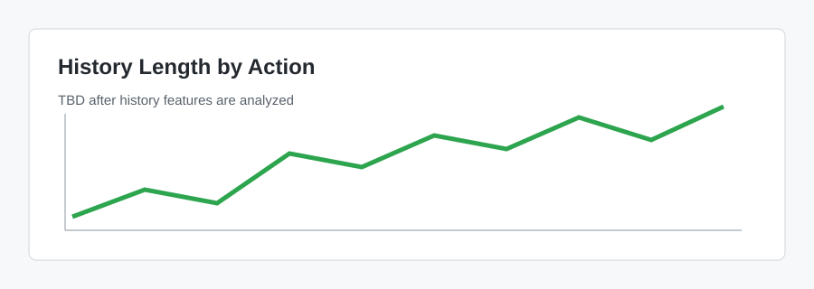

# 데이터 분석

## 목적

데이터 구조, 분포, 초기 인사이트를 기록합니다.

## 이 문서는 무엇인가

EDA 결과를 정리하는 문서입니다. 노트북에서 그래프와 통계를 만들고, 중요한 관찰 결과만 이 문서에 옮겨 적습니다.

아직 데이터 분석을 수행하지 않았으므로 모든 인사이트는 `TBD`로 두었습니다. 실제 분석 전에는 분포, 결측치, label imbalance 같은 결과를 작성하지 않습니다.

## 데이터 스키마

### `train.jsonl` 및 `test.jsonl`

| 필드 | 설명 | 예시 / 비고 |
| --- | --- | --- |
| `id` | 샘플 식별자 | `sess_sim_...-step_02` |
| `session_meta` | 세션 및 작업공간 메타데이터 | 요금제, 언어, 토큰 예산, workspace |
| `history` | 이전 사용자 발화와 에이전트 action | 0~12개 기록 |
| `current_prompt` | 현재 사용자 발화 | 예측 시점의 최신 요청 |

### `train_labels.csv`

| 필드 | 설명 |
| --- | --- |
| `id` | 샘플 식별자 |
| `action` | 14개 target class 중 하나 |

## 분석 계획

- [ ] JSONL과 label 파일 로드
- [ ] `id` 정합성 확인
- [ ] 결측치 확인
- [ ] target class 분포 시각화
- [ ] prompt 길이와 history 길이 분석
- [ ] 메타데이터별 action 분포 분석
- [ ] 주요 그래프를 `results/figures/`에 저장

## Figures

예정 이미지:

## 초기 인사이트

TBD

## 노트북

- [EDA 노트북](../notebooks/EDA.ipynb)
