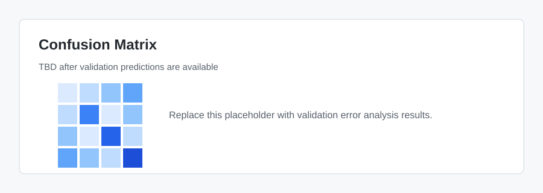

# Error Analysis

## Objective

Understand model failures and convert them into actionable improvements.

## Error Review Checklist

- [ ] Confusion matrix by action class
- [ ] Most common false positives
- [ ] Most common false negatives
- [ ] High-confidence wrong predictions
- [ ] Error patterns by `turn_index`
- [ ] Error patterns by `language_pref`
- [ ] Error patterns by history length

## Confusion Matrix

## Error Buckets

| Bucket | Description | Example | Next Action |
| --- | --- | --- | --- |
| Search vs read | Model confuses discovery and inspection | TBD | Add history/workspace features |
| Edit vs patch | Model confuses edit methods | TBD | Inspect labels and history context |
| Ask vs plan | Model confuses clarification and planning | TBD | Prompt-intent features |

## Findings

TBD

## Notebook

- [Error Analysis Notebook](../notebooks/Error_Analysis.ipynb)
